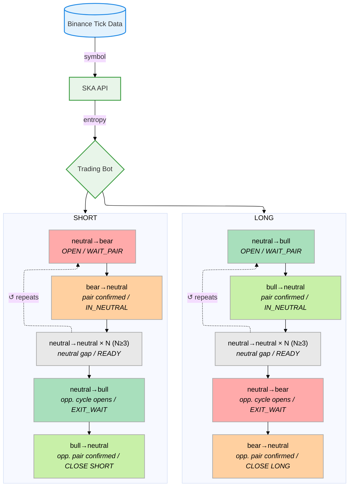

# The True Machine API
The system is called The True Machine because it does not simulate the market. It observes the market as it truly operates across the nine regime transitions.


## Architecture



## Supported Symbols

`XRPUSDT` · `BTCUSDT` · `ETHUSDT` · `SOLUSDT`

---

## Usage

```bash
pip install -r requirements_client.txt
python trading_bot.py --symbol XRPUSDT --api https://api.quantiota.org
```

## Prototype

A ready-to-use trading bot prototype is provided and can be customized.

## User Customization

```python
SYMBOL          = "XRPUSDT"   # XRPUSDT · BTCUSDT · ETHUSDT · SOLUSDT
MIN_NEUTRAL_GAP = 3            # Structural filter
```
