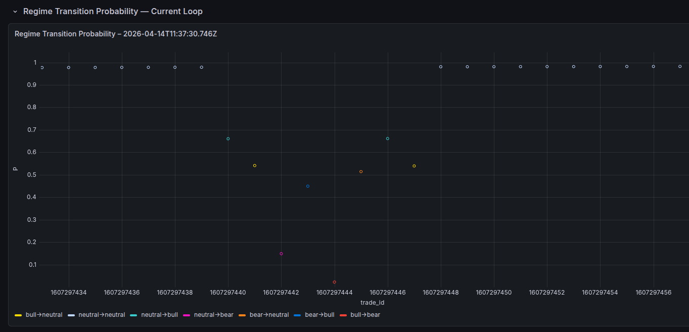
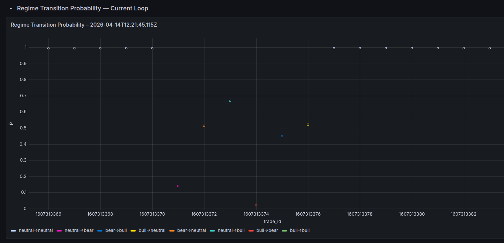
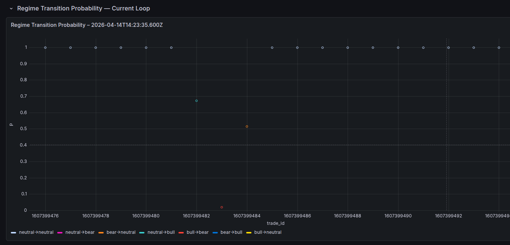
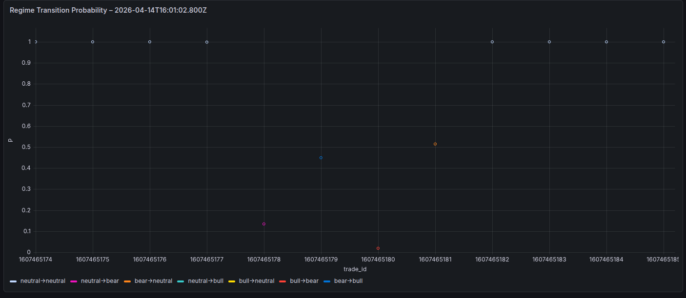

# False Start Panel — Observed Cases

Forensic archive of false starts captured on the live Grafana panel.
Each entry records the transition sequence, P values, and PnL observed in real time.

---

## Format

```
Date       : UTC timestamp of the loop
Trade ID   : Binance trade_id at the false start transition
Sequence   : transition path observed
P values   : P at each transition
```

---

## Cases

<!-- Add new entries below as observed -->

---

### Case 1 — Bull False Start 

**Observed sequence** (trade_id window 1607297434–1607297456):

- `neutral→neutral` P = 1.00 — extended neutral gap
- `neutral→bull`    P ≈ 0.66 — at ~1607297440
- `bull→neutral`    P ≈ 0.51 — bull pair 1 complete ✓
- `neutral→bear`    P ≈ 0.15 — at ~1607297442
- `bear→bull`       P ≈ 0.45 — at ~1607297443
- `bull→bear`       P ≈ 0.02 — at ~1607297444
- `bear→neutral`    P ≈ 0.51 — at ~1607297445
- `neutral→bull`    P ≈ 0.66 — at ~1607297446
- `bull→neutral`    P ≈ 0.51 — bull pair 2 complete ✓
- `neutral→neutral` P = 1.00 — neutral gap resumes

All 7 transition types observed within ~22 trade IDs.



**Episode sequence** (neutral→neutral → ... → neutral→neutral):

```python
{
    "date": "2026-04-14T11:37:30.746Z",
    "trade_id_window": [1607297434, 1607297456],
    "sequence": [
        {"transition": "neutral→neutral", "P": 1.00},
        {"transition": "neutral→bull",    "P": 0.66},
        {"transition": "bull→neutral",    "P": 0.51},
        {"transition": "neutral→bear",    "P": 0.15},
        {"transition": "bear→bull",       "P": 0.45},
        {"transition": "bull→bear",       "P": 0.02},
        {"transition": "bear→neutral",    "P": 0.51},
        {"transition": "neutral→bull",    "P": 0.66},
        {"transition": "bull→neutral",    "P": 0.51},
        {"transition": "neutral→neutral", "P": 1.00}
    ]
}
```

### Case 2 — 2026-04-14T12:21:45.115Z

**Observed sequence** (trade_id window 1607313366–1607313382):

- `neutral→neutral` P = 1.00 — extended neutral gap
- `neutral→bear`    P ≈ 0.15 — at ~1607313371
- `bear→neutral`    P ≈ 0.51 — bear pair complete ✓
- `neutral→bull`    P ≈ 0.66 — at ~1607313373
- `bull→bear`       P ≈ 0.02 — at ~1607313374
- `bear→bull`       P ≈ 0.45 — at ~1607313375
- `bull→neutral`    P ≈ 0.51 — at ~1607313376
- `neutral→neutral` P = 1.00 — neutral gap resumes



**Episode sequence** (neutral→neutral → ... → neutral→neutral):

```python
{
    "date": "2026-04-14T12:21:45.115Z",
    "trade_id_window": [1607313366, 1607313382],
    "sequence": [
        {"transition": "neutral→neutral", "P": 1.00},
        {"transition": "neutral→bear",    "P": 0.15},
        {"transition": "bear→neutral",    "P": 0.51},
        {"transition": "neutral→bull",    "P": 0.66},
        {"transition": "bull→bear",       "P": 0.02},
        {"transition": "bear→bull",       "P": 0.45},
        {"transition": "bull→neutral",    "P": 0.51},
        {"transition": "neutral→neutral", "P": 1.00}
    ]
}
```
---


### Case 3 — 2026-04-14T12:44:51.600Z

**Observed sequence** (trade_id window 1607321228–1607321268):

- `neutral→neutral` P = 1.00 — extended neutral gap
- `neutral→bull`    P ≈ 0.66 — at ~1607321242
- `bull→neutral`    P ≈ 0.51 — at ~1607321244
- `neutral→bear`    P ≈ 0.15 — at ~1607321246
- `bear→bull`       P ≈ 0.45 — at ~1607321247
- `bull→bear`       P ≈ 0.02 — at ~1607321250
- `bear→neutral`    P ≈ 0.51 — at ~1607321266
- `neutral→neutral` P = 1.00 — neutral gap resumes


**Episode sequence** (neutral→neutral → ... → neutral→neutral):

```python
{
    "date": "2026-04-14T12:44:51.600Z",
    "trade_id_window": [1607321228, 1607321268],
    "sequence": [
        {"transition": "neutral→neutral", "P": 1.00},
        {"transition": "neutral→bull",    "P": 0.66},
        {"transition": "bull→neutral",    "P": 0.51},
        {"transition": "neutral→bear",    "P": 0.15},
        {"transition": "bear→bull",       "P": 0.45},
        {"transition": "bull→bear",       "P": 0.02},
        {"transition": "bear→neutral",    "P": 0.51},
        {"transition": "neutral→neutral", "P": 1.00}
    ]
}
```


### Case 4 — 2026-04-14T14:10:22.829Z

**Observed sequence** (trade_id window 1607389098–1607389108):

- `neutral→neutral` P = 1.00 — extended neutral gap
- `neutral→bear`    P ≈ 0.15 — at ~1607389103
- `bear→bull`       P ≈ 0.45 — at ~1607389104
- `bull→neutral`    P ≈ 0.51 — at ~1607389105
- `neutral→neutral` P = 1.00 — neutral gap resumes


**Episode sequence** (neutral→neutral → ... → neutral→neutral):

```python
{
    "date": "2026-04-14T14:10:22.829Z",
    "trade_id_window": [1607389098, 1607389108],
    "sequence": [
        {"transition": "neutral→neutral", "P": 1.00},
        {"transition": "neutral→bear",    "P": 0.15},
        {"transition": "bear→bull",       "P": 0.45},
        {"transition": "bull→neutral",    "P": 0.51},
        {"transition": "neutral→neutral", "P": 1.00}
    ]
}
```


### Case 5 — 2026-04-14T14:23:35.600Z

**Observed sequence** (trade_id window 1607399476–1607399494):

- `neutral→neutral` P = 1.00 — extended neutral gap
- `neutral→bull`    P ≈ 0.66 — at ~1607399482
- `bull→bear`       P ≈ 0.02 — at ~1607399483
- `bear→neutral`    P ≈ 0.51 — at ~1607399484
- `neutral→neutral` P = 1.00 — neutral gap resumes



**Episode sequence** (neutral→neutral → ... → neutral→neutral):

```python
{
    "date": "2026-04-14T14:23:35.600Z",
    "trade_id_window": [1607399476, 1607399494],
    "sequence": [
        {"transition": "neutral→neutral", "P": 1.00},
        {"transition": "neutral→bull",    "P": 0.66},
        {"transition": "bull→bear",       "P": 0.02},
        {"transition": "bear→neutral",    "P": 0.51},
        {"transition": "neutral→neutral", "P": 1.00}
    ]
}
```

### Case 6 — 2026-04-14T14:50:52.094Z

**Observed sequence** (trade_id window 1607434219–1607434236):

- `neutral→neutral` P = 1.00 — extended neutral gap
- `neutral→bear`    P ≈ 0.13 — at ~1607434228
- `bear→neutral`    P ≈ 0.51 — bear pair complete ✓
- `neutral→bull`    P ≈ 0.66 — at ~1607434230
- `bull→bear`       P ≈ 0.02 — at ~1607434231
- `bear→neutral`    P ≈ 0.51 — at ~1607434232
- `neutral→neutral` P = 1.00 — neutral gap resumes


**Episode sequence** (neutral→neutral → ... → neutral→neutral):

```python
{
    "date": "2026-04-14T14:50:52.094Z",
    "trade_id_window": [1607434219, 1607434236],
    "sequence": [
        {"transition": "neutral→neutral", "P": 1.00},
        {"transition": "neutral→bear",    "P": 0.13},
        {"transition": "bear→neutral",    "P": 0.51},
        {"transition": "neutral→bull",    "P": 0.66},
        {"transition": "bull→bear",       "P": 0.02},
        {"transition": "bear→neutral",    "P": 0.51},
        {"transition": "neutral→neutral", "P": 1.00}
    ]
}
```


### Case 7 — 2026-04-14T16:01:02.800Z

**Observed sequence** (trade_id window 1607465174–1607465185):

- `neutral→neutral` P = 1.00 — extended neutral gap
- `neutral→bear`    P ≈ 0.13 — at ~1607465178
- `bear→bull`       P ≈ 0.45 — at ~1607465179
- `bull→bear`       P ≈ 0.02 — at ~1607465180
- `bear→neutral`    P ≈ 0.51 — at ~1607465181
- `neutral→neutral` P = 1.00 — neutral gap resumes



**Episode sequence** (neutral→neutral → ... → neutral→neutral):

```python
{
    "date": "2026-04-14T16:01:02.800Z",
    "trade_id_window": [1607465174, 1607465185],
    "sequence": [
        {"transition": "neutral→neutral", "P": 1.00},
        {"transition": "neutral→bear",    "P": 0.13},
        {"transition": "bear→bull",       "P": 0.45},
        {"transition": "bull→bear",       "P": 0.02},
        {"transition": "bear→neutral",    "P": 0.51},
        {"transition": "neutral→neutral", "P": 1.00}
    ]
}
```
