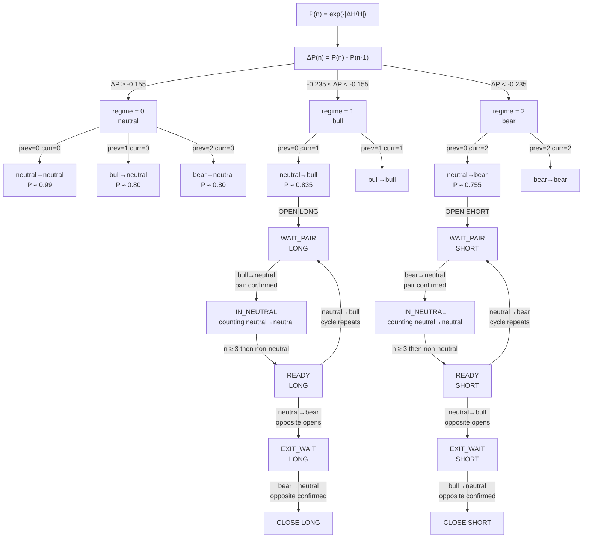

# Structural Probability

## Definition

At each tick n, the SKA API returns an entropy value H (field: `entropy`).
The structural probability P is derived from the relative entropy change between two consecutive ticks:

```
P(n) = exp(−|ΔH/H|)   where   ΔH/H = (H(n) − H(n−1)) / H(n)

P(n) ∈ (0, 1]
```

- `|ΔH/H|` large  →  P close to 0  →  strong structural change
- `|ΔH/H|` small  →  P close to 1  →  entropy barely moving

P is computed by the client from two consecutive `entropy` values returned by the API.

---

## Regime Classification

Define the tick-level probability variation:

```
δP_tick = P(n) − P(n−1)
```

The regime at tick n is classified as:

```
δP_tick < −0.235                    →  bear    (large drop)
−0.235  ≤  δP_tick  <  −0.155      →  bull    (moderate drop)
δP_tick  ≥  −0.155                  →  neutral
```

Both bull and bear are triggered by a negative δP_tick.
The magnitude of the drop is the only distinction between them.

---

## Paired Transition Gap

A trade is a **pair of two transitions**: an opening and a closing.
Define the paired transition gap:

```
ΔP_pair = P(closing transition) − P(opening transition)
```

ΔP_pair is not a tick-by-tick quantity. It is the change in P between the
two regime ticks of the same pair.

---

## ΔP_pair in Each Paired Regime

### Bull pair

```
opening  :  neutral → bull   (LONG pair open)       P ≈ 0.835
closing  :  bull → neutral   (LONG pair confirmed)   P ≈ 0.80

ΔP_pair = 0.80 − 0.835 = −0.028   →   negative
```

P continued to fall between opening and closing.
The closing is not a recovery — it is where the drift slowed below the threshold.

---

### Bear pair

```
opening  :  neutral → bear   (SHORT pair open)       P ≈ 0.755
closing  :  bear → neutral   (SHORT pair confirmed)   P ≈ 0.80

ΔP_pair = 0.80 − 0.755 = +0.045   →   positive
```

P rebounded between opening and closing.
The closing is an active recovery — the entropy shock has resolved.

---

## The Opposite Sign

| Pair  | P at opening | P at closing | ΔP_pair    | Nature                  |
|-------|-------------|--------------|------------|-------------------------|
| Bull  | ≈ 0.835     | ≈ 0.80       | **−0.028** | drift — P falls through |
| Bear  | ≈ 0.755     | ≈ 0.80       | **+0.045** | shock — P snaps back    |

Both pairs open with a negative δP_tick.
In the observed data, bull pairs satisfy `ΔP_pair < 0` while bear pairs satisfy
`ΔP_pair > 0`. This empirical sign separation distinguishes a sustained entropy
drift from a brief entropy shock.

---

## Regime Transitions

### Pair events

| Code | Transition     | Event                   |
|------|----------------|-------------------------|
| 1    | neutral → bull | LONG pair open          |
| 3    | bull → neutral | LONG pair confirmation  |
| 2    | neutral → bear | SHORT pair open         |
| 6    | bear → neutral | SHORT pair confirmation |

### Full trade logic

A trade does not open on the pair open event alone.
The full state machine requires:

```
LONG:
  neutral → bull             LONG pair open        (WAIT_PAIR)
  bull → neutral             pair confirmed         (IN_NEUTRAL)
  neutral × N  (N ≥ 3)       neutral gap            (READY)
  neutral → bear             opposite pair opens    (EXIT_WAIT)
  bear → neutral             opposite confirmed     → CLOSE LONG

SHORT: mirror logic.
```

---

## Constants

| Constant        | Value | Description                               |
|-----------------|-------|-------------------------------------------|
| BULL_THRESHOLD  | 0.155 | δP_tick lower bound for bull regime       |
| BEAR_THRESHOLD  | 0.235 | δP_tick lower bound for bear regime       |
| MIN_NEUTRAL_GAP | 3     | minimum neutral ticks before READY state  |

---

## State Machine Diagram


